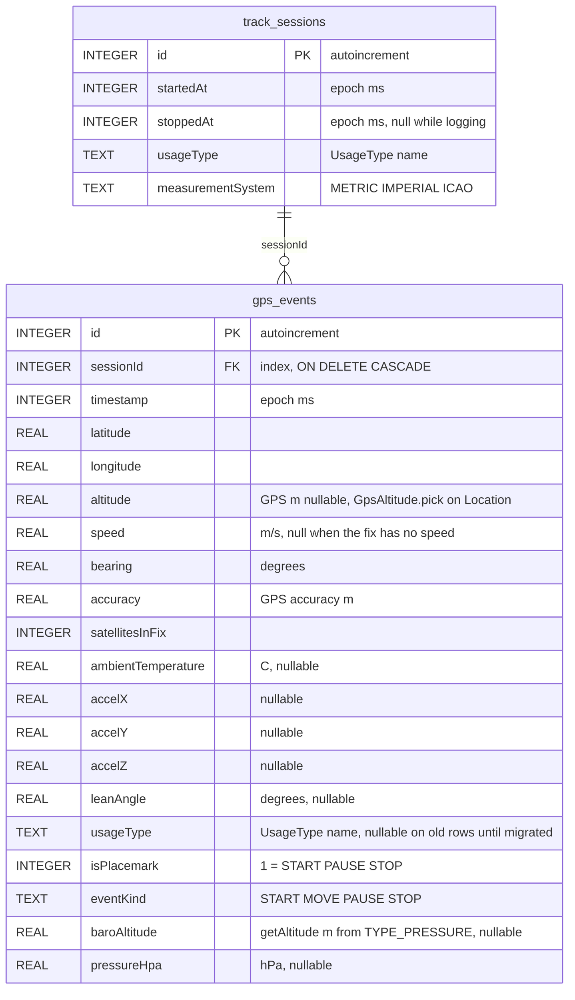
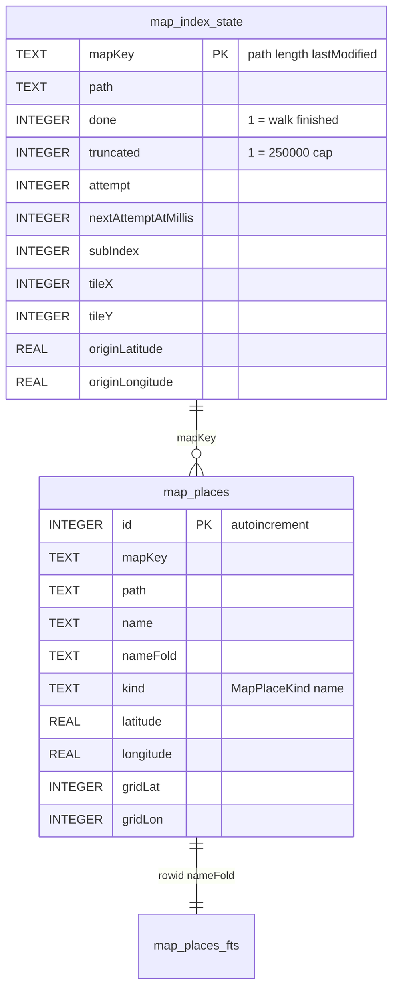

# SQLite database structure

File: `gtl.db` (Room, schema version **6**).  
Package: `com.lkovari.mobile.apps.gtl.data.db`.

Two tables. A session is one logging run. Each stored GPS fix is one row in `gps_events`. Deleting a session **cascade-deletes** its points. Map, Route, and KMZ all read `gps_events` — the red polyline is this table.

## `track_sessions`

| Column | Meaning |
|---|---|
| `id` | Primary key |
| `startedAt` | When logging started |
| `stoppedAt` | When Stop ran; `NULL` = open session |
| `usageType` | `AIRCRAFT`, `WATERCRAFT`, `FOUR_WHEELERS`, `TWO_WHEELERS`, `BICYCLE`, `RUNNER` (settings at start) |
| `measurementSystem` | `METRIC`, `IMPERIAL`, `ICAO` |

Queries: list by `startedAt` descending; find the open session (`stoppedAt IS NULL`).

## `gps_events`

One row = one accepted fix (or the Stop placemark). Polyline, Route totals, Help table, and KMZ all read this table. The Map tab draws these coordinates (optional Douglas–Peucker on display only), so the red line is the stored log.

| Column | Unit / notes |
|---|---|
| `id` | Primary key |
| `sessionId` | Parent session |
| `timestamp` | Fix time |
| `latitude` / `longitude` | WGS84. Source is `GPS_PROVIDER` when **Use GNSS only** is on, otherwise fused HIGH_ACCURACY. If **Smooth recorded track** is on, these are the Kalman output, not the raw HUD fix. |
| `altitude` | metres from the same `Location` after `GpsAltitude.pick` (GNSS MSL, fused MSL, GNSS ellipsoid, fused ellipsoid; drop outside −430…20000 m). **null** if Android reports no altitude or none remain plausible. Existing `0.0` rows stay `0.0` after the 4→5 migration. |
| `speed` | metres per second when the fix reports speed (Kalman velocity when smoothing is on and speed ≥ 0.3 m/s). **null** when Android has no speed for that fix. Existing rows stay as stored through the 5→6 migration. Waiting time ignores null speed. |
| `bearing` | heading degrees (same Kalman rule as speed) |
| `accuracy` | horizontal accuracy metres (raw GPS, even when Kalman moved lat/lon) |
| `satellitesInFix` | GNSS snapshot at insert |
| `ambientTemperature` | °C if `TYPE_AMBIENT_TEMPERATURE` exists |
| `accelX` / `accelY` / `accelZ` | last accelerometer sample |
| `leanAngle` | motorbike lean degrees (gravity, tank mount); nullable |
| `usageType` | `AIRCRAFT`, `WATERCRAFT`, `FOUR_WHEELERS`, `TWO_WHEELERS`, `BICYCLE`, `RUNNER` copied at insert (session usage); backfilled from `track_sessions` on migrate 2→3 |
| `isPlacemark` | `true` for START / PAUSE / STOP (KMZ icons) |
| `eventKind` | `START`, `MOVE`, `PAUSE`, `STOP` |
| `baroAltitude` | metres from `TYPE_PRESSURE` via `SensorManager.getAltitude` (`AndroidBaroAltitude`) using Settings QNH at insert (default `PRESSURE_STANDARD_ATMOSPHERE` 1013.25 hPa); **null** if the phone has no barometer or no sample yet. Display paths may ignore this value when it is more than 1500 m from GPS altitude |
| `pressureHpa` | raw hectopascals at insert; **null** if no sensor. Elevation profile, live baro, and KMZ balloons / ExtendedData `baro` recompute with the current Settings QNH and GPS-calibration offset (KMZ at share time). If that height is more than 1500 m from the point’s GPS altitude, stored `baroAltitude` is used, or baro is omitted (`BaroAltitude.pickDisplayed`) |

`MOVE` rows are the dense track. START / PAUSE / STOP are also stored as points and marked as placemarks. KMZ export places Start / Pause / Stop icons on the path (`TrackLogExport`, `IconStyle` scale 0.8); a trailing STOP that would sit off the log is snapped to the last path vertex. Earth balloons: UTC `YYYY:MM:DD HH:MM:SS`, `temp=` in session units or `temp=N/A`, `lon=` then `lat=`, `Altitude:` (GPS) and `Baro:` (`displayedMeters` from `pressureHpa` at share-time QNH and offset, or `-`; omitted if more than 1500 m from GPS altitude); Pause adds `Speed:`, `duration=` from Start, and `distance=` so far; Stop adds `Avg. Speed:`, `Max speed:`, session `duration=` and `distance=`. KMZ ExtendedData `baro` is share-time displayed metres (`-` if missing or dropped by the 1500 m GPS guard) and `alt` is GPS metres; the visible line is a ground-draped `LineString`. Missing `ambientTemperature` is `temp=N/A`.

## Not stored

- Raw GNSS constellation mix and skyplot samples (HUD / GPS tab only, in memory).
- Map / OSM settings (including OSM layer switches: buildings, POI, transit, cycleways, parks, hillshading). Hillshading only draws when HGT/HF2 files sit next to the `.map` or in `hills/`. Kalman / density / GNSS-only / QNH switches (DataStore, not SQLite). Named places from the `.map` are not in `gtl.db`; they live in [`map-search.db`](#map-searchdb).
- The raw HUD fix when Kalman is on (only the filter output is stored).
- Fix cloud / Pontfelhő samples (in-memory sliding window only). Turning **Show fix cloud** on also writes Show accuracy marker in DataStore; turning it off only clears the in-memory cloud.
- Map-cleared flag (ViewModel memory). The Map broom hides the drawn line; it does not delete `gps_events`.

## Access

`TrackRepository` is the only app-layer API. `RemoteTrackSync.uploadSession` runs on stop and is a no-op.

# `map-search.db`

File: `map-search.db` (Room, schema version **2**, exported under `app/schemas`).  
Package: `com.lkovari.mobile.apps.gtl.data.search`.  
On device: `databases/map-search.db` (Room default).  
API: `MapSearchRepository`. Writer: `MapSearchIndexWorker` (WorkManager).

Derived cache of named places read from the Mapsforge `.map` that is in use (OSM region or Turistautak). It is not the track log. Search, the navigate dialog, and the straight-line distance to a search hit read it. The red polyline does not.

A local debug install that still has schema 1 is emptied on open (`fallbackToDestructiveMigration`). The file stays; the tables are recreated empty and the worker fills them again from the `.map`. The track database is not migrated by this.

`mapKey` is `path|length|lastModified` of the `.map` file. Unique index on `(mapKey, nameFold, kind, gridLat, gridLon)`. Duplicate inserts are ignored. `map_places_fts` is an FTS4 content table on `nameFold` only; Room keeps it in sync when `map_places` rows are inserted or deleted. There is no second write path.

| Column | Meaning |
|---|---|
| `done` | The tile walk finished under the cap. Search uses the rows. The worker does not open the `.map` again for this key. |
| `truncated` | `MapSearch.MaxIndexedPlaces` (250 000 successful inserts) was hit. Search works on the partial set and the UI says so. The walk does not resume. |
| `attempt` / `nextAttemptAtMillis` | After a failed read. The worker returns `Result.retry()` and does not scan until `nextAttemptAtMillis`. Places already stored stay. |
| `subIndex`, `tileX`, `tileY` | Next tile to read. `tileX = Long.MIN_VALUE` means the walk has not started. A killed process resumes here. |
| `originLatitude` / `originLongitude` | `.map` start position. Distance ranking uses the live GPS fix when there is one, otherwise this origin. |

## When the file is created

`GtlApplication` builds `MapSearchRepository` at process start. Room does not create the file until the first query.

That query is `activate`, from `GtlViewModel.observeActiveMapSearch`, and only when a selected `.map` is in use and `OsmMapFile.isReadable` is true (OSM or Turistautak, **Use downloaded OSM map** effective). Google Maps alone, a blank selection, or an unreadable file calls `activate(null)`, which does not open SQLite. The file appears the first time such a map is actually in use.

## When rows are deleted

The app never deletes the `map-search.db` file. Uninstall and Clear storage do. Schema 1→2 drops the tables inside the file and leaves the file in place.

| Event | Rows | File | Walk |
|---|---|---|---|
| Delete downloaded OSM region, or delete Turistautak | `deletePath`: places and state for that path, one transaction. The unique work is cancelled first. | kept | stopped |
| Switch to a different `.map` path | `deleteExcept`: every path other than the new one, one transaction. The previous work is cancelled. | kept | the new path follows the rules below |
| Same path, new `mapKey` (length or lastModified changed) | `deletePath` for that path, because the new key has no state row. | kept | full walk from the first tile (`REPLACE`) |
| Leave offline maps (Google, switch off, unreadable file) | kept | kept | work cancelled (`stopActive`). No row delete. |
| Process death mid-walk | kept | kept | resumes from the cursor on the next launch |
| Read exception | kept | kept | no scan until `nextAttemptAtMillis`; then resume, not a wipe |
| Cap reached (`truncated`) | kept | kept | does not run again for this key |
| Walk finished (`done`) | kept | kept | does not run again for this key |

Only one `.map` path is stored at a time. Switching maps drops the previous path’s places.

## When it indexes again

`IndexResume.action` decides. `activate` enqueues `MapSearchIndexWorker` only for **Resume** and **Backoff**. Constraints: battery not low, storage not low. Backoff is exponential from 30 s. Unique work name is `map-search-<path length>-<path hashCode>`.

| State for this `mapKey` | What happens |
|---|---|
| No row | Full walk from the first tile. This is first use, a replaced file, a wiped path, or an emptied schema-1 database. |
| `done = 0`, `truncated = 0`, retry time reached | Resume at `subIndex` / `tileX` / `tileY`. Places stay. The `MapFile` opens and closes every 32 tiles. The cursor is saved after each batch. |
| `done = 0`, `truncated = 0`, retry time in the future | No tile read. Worker `Result.retry()`. |
| `done = 1` | Ready. Work cancelled. Search only. |
| `truncated = 1` | Partial ready. Work cancelled. Search only. |
| Same path and key already indexing or ready | `activate` returns. It does not enqueue a second walk. |

A killed worker does not wipe places. The next `activate` sees the cursor and continues. `done` is written only after the last tile. `truncated` is written when the 250 000 insert cap is hit, and that key is never resumed.
