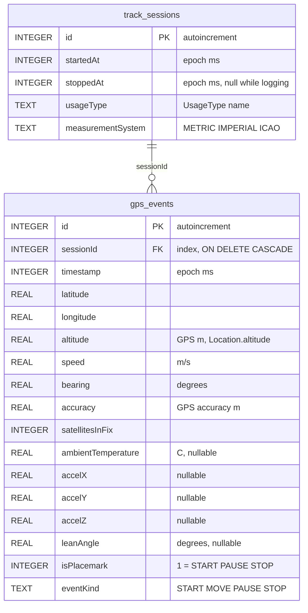

# SQLite database structure

File: `gtl.db` (Room, schema version **2**).  
Package: `com.lkovari.mobile.apps.gtl.data.db`.

Two tables. A session is one logging run. Each stored GPS fix is one row in `gps_events`. Deleting a session **cascade-deletes** its points. Map, Route, and KMZ all read `gps_events` — the red polyline is this table.

## `track_sessions`

| Column | Meaning |
|---|---|
| `id` | Primary key |
| `startedAt` | When logging started |
| `stoppedAt` | When Stop ran; `NULL` = open session |
| `usageType` | `AIRCRAFT`, `WATERCRAFT`, `FOUR_WHEELERS`, `TWO_WHEELERS`, `RUNNER` (settings at start) |
| `measurementSystem` | `METRIC`, `IMPERIAL`, `ICAO` |

Queries: list by `startedAt` descending; find the open session (`stoppedAt IS NULL`).

## `gps_events`

One row = one accepted fix (or the Stop placemark). Polyline, Route totals, Help table, and KMZ all read this table. The Map tab draws these coordinates (optional Douglas–Peucker on display only), so the red line is the stored log.

| Column | Unit / notes |
|---|---|
| `id` | Primary key |
| `sessionId` | Parent session |
| `timestamp` | Fix time |
| `latitude` / `longitude` | WGS84. Source is `GPS_PROVIDER` when **Use GNSS only** is on, otherwise fused HIGH_ACCURACY. If **Smooth recorded track** is on, these are the Kalman output, not the raw HUD fix. |
| `altitude` | metres, from the same `Location` object (GPS altitude) |
| `speed` | metres per second (Kalman velocity when smoothing is on and speed ≥ 0.3 m/s) |
| `bearing` | heading degrees (same Kalman rule as speed) |
| `accuracy` | horizontal accuracy metres (raw GPS, even when Kalman moved lat/lon) |
| `satellitesInFix` | GNSS snapshot at insert |
| `ambientTemperature` | °C if `TYPE_AMBIENT_TEMPERATURE` exists |
| `accelX` / `accelY` / `accelZ` | last accelerometer sample |
| `leanAngle` | motorbike lean degrees (gravity, tank mount); nullable |
| `isPlacemark` | `true` for START / PAUSE / STOP (KMZ icons) |
| `eventKind` | `START`, `MOVE`, `PAUSE`, `STOP` |

`MOVE` rows are the dense track. START / PAUSE / STOP are also stored as points and marked as placemarks.

## Not stored

- Barometric pressure / baro altitude (planned: aircraft + ICAO).
- Raw GNSS constellation mix (HUD only, in memory).
- Map / OSM settings, Kalman / density / GNSS-only switches (DataStore, not SQLite).
- The raw HUD fix when Kalman is on (only the filter output is stored).

## Access

`TrackRepository` is the only app-layer API. `RemoteTrackSync.uploadSession` runs on stop and is a no-op.
