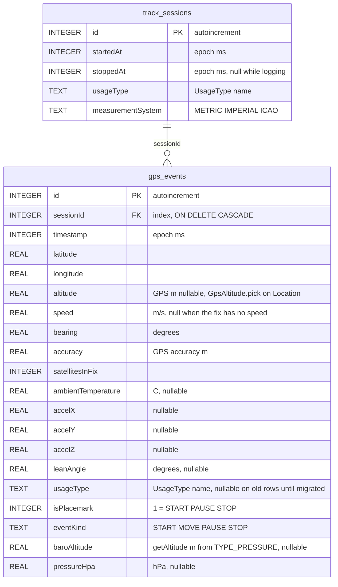

# SQLite database structure

File: `gtl.db` (Room, schema version **6**).  
Package: `com.lkovari.mobile.apps.gtl.data.db`.

Two tables. A session is one logging run. Each stored GPS fix is one row in `gps_events`. Deleting a session **cascade-deletes** its points. Map, Route, and KMZ all read `gps_events` — the red polyline is this table.

## `track_sessions`

| Column | Meaning |
|---|---|
| `id` | Primary key |
| `startedAt` | When logging started |
| `stoppedAt` | When Stop ran; `NULL` = open session |
| `usageType` | `AIRCRAFT`, `WATERCRAFT`, `FOUR_WHEELERS`, `TWO_WHEELERS`, `BICYCLE`, `RUNNER` (settings at start) |
| `measurementSystem` | `METRIC`, `IMPERIAL`, `ICAO` |

Queries: list by `startedAt` descending; find the open session (`stoppedAt IS NULL`).

## `gps_events`

One row = one accepted fix (or the Stop placemark). Polyline, Route totals, Help table, and KMZ all read this table. The Map tab draws these coordinates (optional Douglas–Peucker on display only), so the red line is the stored log.

| Column | Unit / notes |
|---|---|
| `id` | Primary key |
| `sessionId` | Parent session |
| `timestamp` | Fix time |
| `latitude` / `longitude` | WGS84. Source is `GPS_PROVIDER` when **Use GNSS only** is on, otherwise fused HIGH_ACCURACY. If **Smooth recorded track** is on, these are the Kalman output, not the raw HUD fix. |
| `altitude` | metres from the same `Location` after `GpsAltitude.pick` (GNSS MSL, fused MSL, GNSS ellipsoid, fused ellipsoid; drop outside −430…20000 m). **null** if Android reports no altitude or none remain plausible. Existing `0.0` rows stay `0.0` after the 4→5 migration. |
| `speed` | metres per second when the fix reports speed (Kalman velocity when smoothing is on and speed ≥ 0.3 m/s). **null** when Android has no speed for that fix. Existing rows stay as stored through the 5→6 migration. Waiting time ignores null speed. |
| `bearing` | heading degrees (same Kalman rule as speed) |
| `accuracy` | horizontal accuracy metres (raw GPS, even when Kalman moved lat/lon) |
| `satellitesInFix` | GNSS snapshot at insert |
| `ambientTemperature` | °C if `TYPE_AMBIENT_TEMPERATURE` exists |
| `accelX` / `accelY` / `accelZ` | last accelerometer sample |
| `leanAngle` | motorbike lean degrees (gravity, tank mount); nullable |
| `usageType` | `AIRCRAFT`, `WATERCRAFT`, `FOUR_WHEELERS`, `TWO_WHEELERS`, `BICYCLE`, `RUNNER` copied at insert (session usage); backfilled from `track_sessions` on migrate 2→3 |
| `isPlacemark` | `true` for START / PAUSE / STOP (KMZ icons) |
| `eventKind` | `START`, `MOVE`, `PAUSE`, `STOP` |
| `baroAltitude` | metres from `TYPE_PRESSURE` via `SensorManager.getAltitude` (`AndroidBaroAltitude`) using Settings QNH at insert (default `PRESSURE_STANDARD_ATMOSPHERE` 1013.25 hPa); **null** if the phone has no barometer or no sample yet. Display paths may ignore this value when it is more than 1500 m from GPS altitude |
| `pressureHpa` | raw hectopascals at insert; **null** if no sensor. Elevation profile, live baro, and KMZ balloons / ExtendedData `baro` recompute with the current Settings QNH and GPS-calibration offset (KMZ at share time). If that height is more than 1500 m from the point’s GPS altitude, stored `baroAltitude` is used, or baro is omitted (`BaroAltitude.pickDisplayed`) |

`MOVE` rows are the dense track. START / PAUSE / STOP are also stored as points and marked as placemarks. KMZ export places Start / Pause / Stop icons on the path (`TrackLogExport`, `IconStyle` scale 0.8); a trailing STOP that would sit off the log is snapped to the last path vertex. Earth balloons: UTC `YYYY:MM:DD HH:MM:SS`, `temp=` in session units or `temp=N/A`, `lon=` then `lat=`, `Altitude:` (GPS) and `Baro:` (`displayedMeters` from `pressureHpa` at share-time QNH and offset, or `-`; omitted if more than 1500 m from GPS altitude); Pause adds `Speed:`, `duration=` from Start, and `distance=` so far; Stop adds `Avg. Speed:`, `Max speed:`, session `duration=` and `distance=`. KMZ ExtendedData `baro` is share-time displayed metres (`-` if missing or dropped by the 1500 m GPS guard) and `alt` is GPS metres; the visible line is a ground-draped `LineString`. Missing `ambientTemperature` is `temp=N/A`.

## Not stored

- Raw GNSS constellation mix and skyplot samples (HUD / GPS tab only, in memory).
- Map / OSM settings (including OSM layer switches: buildings, POI, transit, cycleways, parks, hillshading). Hillshading only draws when HGT/HF2 files sit next to the `.map` or in `hills/`. Kalman / density / GNSS-only / QNH switches (DataStore, not SQLite).
- The raw HUD fix when Kalman is on (only the filter output is stored).
- Fix cloud / Pontfelhő samples (in-memory sliding window only). Turning **Show fix cloud** on also writes Show accuracy marker in DataStore; turning it off only clears the in-memory cloud.
- Map-cleared flag (ViewModel memory). The Map broom hides the drawn line; it does not delete `gps_events`.

## Access

`TrackRepository` is the only app-layer API. `RemoteTrackSync.uploadSession` runs on stop and is a no-op.
