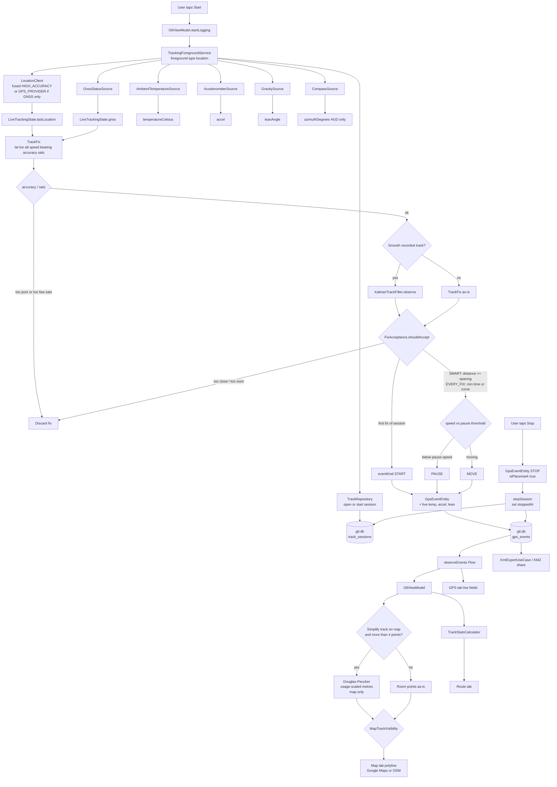

# GPS event listening and data flow

How a location update becomes a SQLite row, then the map, Route HUD, and KMZ. The Map polyline is those Room coordinates — there is no second sketch. Why that line looks like the path you took: [README-en.md — How logging works](../README-en.md#how-logging-works).

## Listeners (in the foreground service)

| Source | What it feeds |
|---|---|
| `LocationClient` | Fused `PRIORITY_HIGH_ACCURACY`, or `GPS_PROVIDER` when **Use GNSS only** is on. Interval from settings, at least 500 ms. Min distance on the request is `0`; spacing is applied later. If the GPS provider is disabled, fused is used. While the app is open and not logging, `GtlViewModel` also listens about once a second for the GPS/Map HUD. After Start, only the foreground service writes SQLite. |
| `GnssStatusSource` | Satellite counts and SNR for the GPS tab; `satellitesInFix` on each stored row. |
| `AmbientTemperatureSource` | Optional; copied onto the row if the sensor exists. |
| `AccelerometerSource` | Optional; last XYZ on the row. |
| `GravitySource` | Optional; `TYPE_GRAVITY` (else accelerometer) → lean angle on the row and Route HUD. |
| `CompassSource` | HUD / Compass tab only; **not** written to SQLite. |

All of this runs under a **visible** location foreground notification. There is no `ACCESS_BACKGROUND_LOCATION`.

## Gate: `FixAcceptance`

A poor-accuracy or low-satellite fix never enters the Kalman filter. The HUD `lastLocation` still updates.

A remaining fix is stored only if:

1. `accuracy` ≤ settings minimum accuracy (m) and `satellitesInFix` ≥ settings minimum (default 4) — already checked before Kalman.
2. It is the first point of the session, **or**
   - **Smart density:** haversine distance from the last **stored** point is at least `SpeedAdaptiveSpacing` (speed bands; half spacing if heading change &gt; 15°; runner SMART uses half of that band).
   - **Every good fix:** elapsed time ≥ `minTimeMillis` **or** heading curve, and distance ≥ 1 m (vehicles) or 0.5 m (runner). If GPS bearing is 0, heading can come from consecutive positions.

Optional **KalmanTrackFilter** (constant-velocity, position-only) runs after the accuracy/sat gate and before spacing. Output lat/lon is the filter state; timestamp, altitude, accuracy, and sats stay with the GPS fix. Speed and bearing come from filter velocity when that speed is at least 0.3 m/s. Measurement σ = max(GPS accuracy, 2 m). Pedestrian usages add extra position process noise so a 5 m loop is not pulled onto the street. Stationary lock holds the stored point when slower than the usage pause speed. Jump (innovation larger than `max(50 m, 8 × accuracy)`) re-initializes; it does not interpolate across a gap.

Rejected updates still refresh `lastLocation` for the GPS/Map HUD.

## `eventKind`

| Kind | When |
|---|---|
| `START` | First accepted fix (or resume with no prior point). |
| `MOVE` | Accepted and speed ≥ usage pause threshold. |
| `PAUSE` | Accepted and speed below pause threshold (default 0.4 m/s; 0.25 m/s for runner). |
| `STOP` | User Stop; last location written even if the gate would drop it. |

`isPlacemark` is true for START / PAUSE / STOP (KMZ play / pause / stop icons).

## After SQLite

`GtlViewModel` observes `gps_events` for the live session, a Saved-tracks selection, or the last session if **Show last logged route on map** is on. The Map polyline **is** those Room coordinates. There is no in-memory sketch, so what you see on Map is the log that was stored (optionally thinned by Douglas–Peucker for drawing only).

- **Route** totals from `TrackStatsCalculator` while logging (raw Room samples).
- **Map** polyline from Room; optional Douglas–Peucker (below); hidden unless logging, last-track, or a selected session (`MapTrackVisibility`).
- **Share** builds KMZ (`gx:Track` + balloons) from the same Room rows. KMZ is never simplified.

Nothing is uploaded. `RemoteTrackSync` on stop is a no-op.

## Why the map looks like the stored log

| Layer | Job |
|---|---|
| GNSS chip vs fused | Runner default uses `GPS_PROVIDER` so a street-scale loop is not flattened by fused Wi-Fi/cell. Vehicles stay fused. |
| Accuracy / sats | Poor fixes never enter Kalman or Room. |
| Kalman (optional) | Moves stored lat/lon; vehicles on, runner off. HUD purple circle stays on the raw fix. |
| Density | Smart (speed bands) or Every good (~500 ms, 0.5 m floor for runner). |
| Room | Single source for Map, Route, KMZ. |
| Douglas–Peucker | Display-only. Runner default is off, so every stored vertex is drawn. |

Full prose: [README-en.md — How logging works](../README-en.md#how-logging-works).

## Map polyline: Douglas–Peucker

**Purpose.** Fewer vertices on the Map tab so a long track stays cheap to draw. SQLite, Route stats, and KMZ keep every stored point.

**When.** Settings **Simplify track on map** (on by default for vehicles, off for runner) and more than 4 points. Tolerance is a **1–20 m** slider (1 m steps), chosen by usage (motorbike 6 m, car 8 m, aircraft 15 m, runner 2 m if turned on). Hidden when the switch is off; the stored value is kept. `GtlViewModel` → `DouglasPeucker.clampTolerance` → `simplify`. Kalman, not Douglas–Peucker, is the noise filter.

**How.** Keep the segment’s first and last points. Find the intermediate point with the largest perpendicular distance (metres, local `111_320` m/deg projection) to the chord between them. If that distance is above the tolerance, keep the point and recurse on both sides; otherwise drop every intermediate point.

This discards near-colinear jitter. It does not smooth GPS noise — leftover corners stay sharp. Full write-up: [README-en.md](../README-en.md#douglaspeucker-map-simplify).
