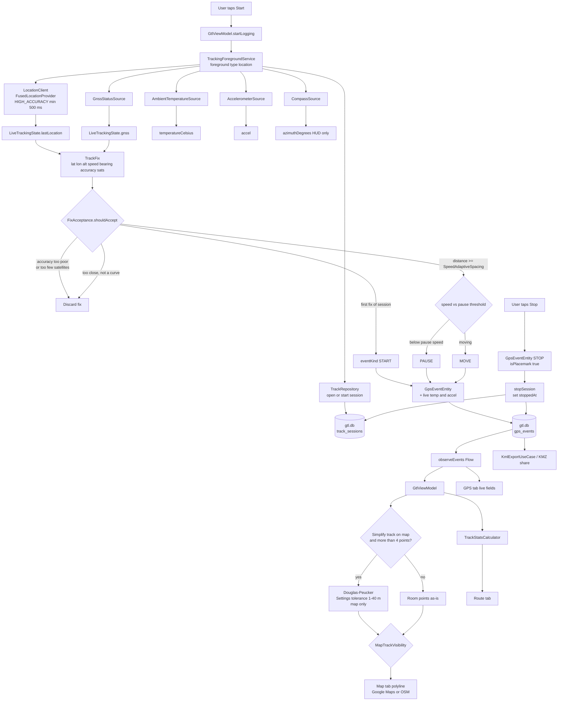

# GPS event listening and data flow

How a fused location update becomes a SQLite row, then the map, Route HUD, and KMZ.

## Listeners (in the foreground service)

| Source | What it feeds |
|---|---|
| `LocationClient` | Play Services fused location, `PRIORITY_HIGH_ACCURACY`. Interval from settings, at least 500 ms. Min distance on the request is `0`; spacing is applied later. |
| `GnssStatusSource` | Satellite counts and SNR for the GPS tab; `satellitesInFix` on each stored row. |
| `AmbientTemperatureSource` | Optional; copied onto the row if the sensor exists. |
| `AccelerometerSource` | Optional; last XYZ on the row. |
| `CompassSource` | HUD / Compass tab only; **not** written to SQLite. |

All of this runs under a **visible** location foreground notification. There is no `ACCESS_BACKGROUND_LOCATION`.

## Gate: `FixAcceptance`

A fix is stored only if:

1. `accuracy` ≤ settings minimum accuracy (m).
2. `satellitesInFix` ≥ settings minimum (default 4).
3. It is the first point of the session, **or** haversine distance from the last **stored** point is at least `SpeedAdaptiveSpacing` (speed bands; half spacing if heading change &gt; 15°).

Rejected updates still refresh `lastLocation` for the GPS/Map HUD.

## `eventKind`

| Kind | When |
|---|---|
| `START` | First accepted fix (or resume with no prior point). |
| `MOVE` | Accepted and speed ≥ usage pause threshold. |
| `PAUSE` | Accepted and speed below pause threshold (default 0.4 m/s; 0.25 m/s for runner). |
| `STOP` | User Stop; last location written even if the gate would drop it. |

`isPlacemark` is true for START / PAUSE / STOP (KMZ play / pause / stop icons).

## After SQLite

`GtlViewModel` observes `gps_events` for the live session, a Saved-tracks selection, or the last session if **Show last logged route on map** is on.

- **Route** totals from `TrackStatsCalculator` while logging (raw Room samples).
- **Map** polyline from Room; optional Douglas–Peucker (below); hidden unless logging, last-track, or a selected session (`MapTrackVisibility`).
- **Share** builds KMZ (`gx:Track` + balloons) from the same Room rows. KMZ is never simplified.

Nothing is uploaded. `RemoteTrackSync` on stop is a no-op.

## Map polyline: Douglas–Peucker

**Purpose.** Fewer vertices on the Map tab so a long track stays cheap to draw. SQLite, Route stats, and KMZ keep every stored point.

**When.** Settings **Simplify track on map** (on by default) and more than 4 points. Tolerance is the Settings slider (**1.0–40.0 m**, **0.5 m** steps, default **19.5 m**, remembered). Hidden when the switch is off; the stored value is kept. `GtlViewModel` → `DouglasPeucker.clampTolerance` → `simplify`.

**How.** Keep the segment’s first and last points. Find the intermediate point with the largest perpendicular distance (metres, local `111_320` m/deg projection) to the chord between them. If that distance is above the tolerance, keep the point and recurse on both sides; otherwise drop every intermediate point.

This discards near-colinear jitter. It does not smooth GPS noise — leftover corners stay sharp. Full write-up: [README.md](../README.md#douglaspeucker-map-simplify).
