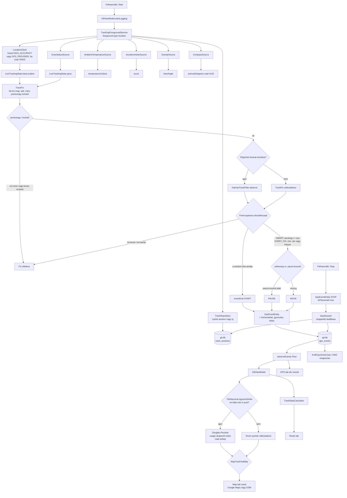

# GPS eseményfigyelés és adatút

Hogyan lesz a helyfrissítésből SQLite sor, majd térkép, Route HUD és KMZ. A Map polyline ezek a Room koordináták — nincs külön vázlat. Miért néz ki a vonal úgy, ahogy mentél: [README.md — How logging works](../README.md#how-logging-works).

## Figyelők (a foreground service-ben)

| Forrás | Mit táplál |
|---|---|
| `LocationClient` | Fused `PRIORITY_HIGH_ACCURACY`, vagy `GPS_PROVIDER`, ha a **Csak GNSS** be van. Intervallum a beállításból, legalább 500 ms. A kérés `minDistance` értéke `0`; a sűrűséget később szűrjük. Ha a GPS-szolgáltató ki van kapcsolva, fused-et használ. Amíg az app nyitva van és nem logol, a `GtlViewModel` kb. másodpercenként figyel a GPS/Map HUD-hoz. Start után csak a foreground service ír SQLite-ot. |
| `GnssStatusSource` | Műholdszám és SNR a GPS fülre; `satellitesInFix` a letárolt soron. |
| `AmbientTemperatureSource` | Opcionális; a sorra másolódik, ha van szenzor. |
| `AccelerometerSource` | Opcionális; utolsó XYZ a soron. |
| `GravitySource` | Opcionális; `TYPE_GRAVITY` (különben gyorsulásmérő) → dőlésszög a soron és a Route HUD-on. |
| `CompassSource` | Csak HUD / Compass fül; **nem** kerül SQLite-ba. |

Mindez **látható** location foreground értesítéssel fut. Nincs `ACCESS_BACKGROUND_LOCATION`.

## Kapu: `FixAcceptance`

A rossz pontosságú vagy kevés műholdas fix nem kerül a Kalman-szűrőbe. A HUD `lastLocation` ettől még frissül.

Egy maradék fix csak akkor tárolódik, ha:

1. `accuracy` ≤ a beállítás szerinti minimális pontosság (m) és `satellitesInFix` ≥ a minimum (alapból 4) — ez a Kalman előtt már lefut.
2. Ez a session első pontja, **vagy**
   - **Okos sűrűség:** a haversine-távolság az utolsó **eltárolt** ponttól legalább a `SpeedAdaptiveSpacing` (sebesség-sávok; fél távolság, ha az irányszög változása &gt; 15°; futó SMART felezi a sávot).
   - **Minden jó fix:** eltelt idő ≥ `minTimeMillis` **vagy** kanyar, és távolság ≥ 1 m (jármű) vagy 0,5 m (futó). Ha a GPS irány 0, az irányszög jöhet a szomszédos pontokból.

Opcionális **KalmanTrackFilter** (konstans sebesség, csak pozíció) a pontosság/műhold kapu után és a távolságszűrés előtt fut. A kimeneti szélesség/hosszúság a szűrő állapota; az időbélyeg, magasság, pontosság és műholdszám a GPS-fixé marad. A sebesség és az irányszög a szűrő sebességéből jön, ha az legalább 0,3 m/s. Mérési σ = max(GPS pontosság, 2 m). Gyalogos usage extra helyzet-zajjal dolgozik, hogy egy 5 m-es kört ne húzzon az utcára. Álló zár: a pauza-küszöb alatt a letárolt pont nem vándorol. Ugrás (innováció &gt; `max(50 m, 8 × pontosság)`) újrainicializál; a hézagot nem interpolálja.

Az elutasított frissítések is frissítik a `lastLocation`-t a GPS/Map HUD-hoz.

## `eventKind`

| Kind | Mikor |
|---|---|
| `START` | Első elfogadott fix (vagy folytatás, ha még nincs pont). |
| `MOVE` | Elfogadott, és a sebesség ≥ a usage pauza-küszöbe. |
| `PAUSE` | Elfogadott, és a sebesség a küszöb alatt (alap 0,4 m/s; futónál 0,25 m/s). |
| `STOP` | A user Stop; az utolsó helyzet akkor is beíródik, ha a kapu eldobná. |

`isPlacemark` igaz START / PAUSE / STOP-nál (KMZ play / pause / stop ikonok).

## SQLite után

A `GtlViewModel` a `gps_events`-et figyeli: élő session, Saved tracks választás, vagy az utolsó session, ha a **Show last logged route on map** be van kapcsolva. A Map polyline **ezek** a Room koordináták. Nincs külön vázlat a memóriában, ezért a térképen azt a logot látod, ami el lett tárolva (Douglas–Peucker csak a rajzolást ritkíthatja).

- **Route** összesítők: `TrackStatsCalculator`, logolás közben (nyers Room minták).
- **Map** polyline Room-ból; opcionális Douglas–Peucker (lent); csak logoláskor, last-track-nél vagy kijelölt sessionnél (`MapTrackVisibility`).
- **Megosztás** ugyanebből a KMZ-t építi (`gx:Track` + balloonok). A KMZ soha nem egyszerűsített.

Nincs feltöltés. A Stop utáni `RemoteTrackSync` no-op.

## Miért egyezik a térkép a letárolt loggal

| Réteg | Feladat |
|---|---|
| GNSS chip vs fused | Futó alapból `GPS_PROVIDER`, hogy egy utcai méretű kört ne lapítson el a fused Wi-Fi/cella. Járművek fused-en maradnak. |
| Pontosság / műhold | Rossz fix nem megy Kalmanba és Roomba. |
| Kalman (opcionális) | Mozgatja a letárolt szélességet/hosszúságot; járműveknél be, futónál ki. A HUD lila köre a nyers fixen marad. |
| Sűrűség | Okos (sebesség-sávok) vagy Minden jó (~500 ms, futónál 0,5 m padló). |
| Room | Egy forrás a Map, Route és KMZ számára. |
| Douglas–Peucker | Csak megjelenítés. Futó alapból ki, ezért minden letárolt csúcs kirajzolódik. |

Részletes leírás: [README.md — How logging works](../README.md#how-logging-works).

## Térképvonal: Douglas–Peucker

**Cél.** Kevesebb csúcspont a Map fülön, hogy egy hosszú track olcsón rajzolható maradjon. Az SQLite, a Route összesítők és a KMZ minden eltárolt pontot megtart.

**Mikor.** Beállítás: **Simplify track on map** / **Útvonal egyszerűsítése a térképen** (járműveknél alapból be, futónál ki), és több mint 4 pont. A tűrés csúszka **1–20 m** (1 m-es lépés), usage szerint (motor 6 m, autó 8 m, repülő 15 m, futó 2 m ha bekapcsolják). A kapcsoló ki a csúszkát elrejti, a tárolt értéket megtartja. `GtlViewModel` → `DouglasPeucker.clampTolerance` → `simplify`. A zajszűrő a Kalman, nem a Douglas–Peucker.

**Hogyan.** A szakasz első és utolsó pontja mindig megmarad. A köztes pontok közül azt választjuk, amelynek a merőleges távolsága (méterben, helyi `111_320` m/fok vetület) a két végpontot összekötő húrhoz a legnagyobb. Ha ez a távolság a tolerancia fölött van, a pontot megtartjuk, és mindkét oldalon rekurzívan folytatjuk; különben minden köztes pontot eldobunk.

Ez a közel egyenes szakaszok zaját csökkenti. GPS-zajt nem simít — a megmaradó sarkok élesek maradnak. Részletes leírás: [README.md](../README.md#douglaspeucker-map-simplify).
