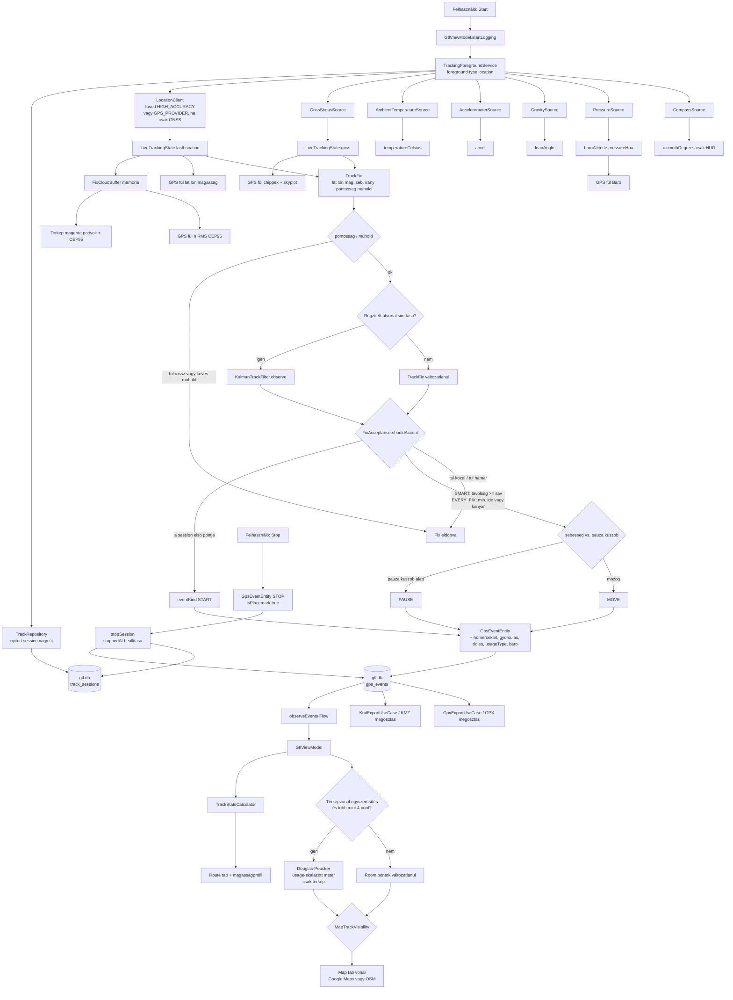

# GPS eseményfigyelés és adatút

Hogyan lesz a helyfrissítésből SQLite sor, majd térkép, Route HUD és KMZ. A Map polyline ezek a Room koordináták — nincs külön vázlat. Miért néz ki a vonal úgy, ahogy mentél: [README-hu.md — Hogyan működik a naplózás](../README-hu.md#hogyan-működik-a-naplózás). A chipen látható konstelációk és sávok: [all-gps-systems-hu.md](all-gps-systems-hu.md).

## Figyelők (a foreground service-ben)

| Forrás | Mit táplál |
|---|---|
| `LocationClient` | Fused `PRIORITY_HIGH_ACCURACY`, vagy `GPS_PROVIDER`, ha a **Csak GNSS** be van. Intervallum a beállításból, legalább 500 ms. A kérés `minDistance` értéke `0`; a sűrűséget később szűrjük. Felvételnél `waitForAccurateLocation`, és 10 s-nél idősebb pont eldobva. Ha a **Csak GNSS** be van és a GPS ki, a flow üres (nincs fused tartalék). Precíz helymeghatározás kell. Fused mellett a `GPS_PROVIDER` a magassághoz is figyel. A HUD/tárolt magasság `GpsAltitude.pick` ebben a sorrendben: GNSS MSL, fused MSL, GNSS ellipszoid, fused ellipszoid. −430…20000 m-en kívül eldobva; ha nincs maradék, a `Location`-ről levesszük a magasságot, és nullként tároljuk. Amíg az app nyitva van és nem logol, a `GtlViewModel` kb. másodpercenként figyel a GPS/Map HUD-hoz. Start után a preview leáll, csak a foreground service ír SQLite-ot. |
| `GnssStatusSource` | Műholdszám és SNR a GPS fülre; műholdankénti azimut/eleváció a `GnssSnapshot.satellites`-en a polar skyplothoz; `satellitesInFix` a letárolt soron. A konstelláció-mix és a skyplot csak memória. Lásd [Skyplot körök](#skyplot-körök-gps-fül). |
| `AmbientTemperatureSource` | Opcionális; a sorra másolódik, ha van szenzor. |
| `AccelerometerSource` | Opcionális; utolsó XYZ a soron. |
| `GravitySource` | Opcionális; `TYPE_GRAVITY` (különben gyorsulásmérő) → dőlésszög a soron és a Route HUD-on. |
| `PressureSource` | Opcionális; `TYPE_PRESSURE` → nyers `pressureHpa` és `baroAltitude` a `SensorManager.getAltitude` szerint (`AndroidBaroAltitude`), a jelenlegi Beállítások QNH-val mínusz a DataStore nyomás-offset (QNH 900–1100 hPa, alap `PRESSURE_STANDARD_ATMOSPHERE` 1013,25; offset ±10 hPa, alap 0). Az élő HUD, az Útvonal/Mentett magasságprofil és a KMZ a `displayedMeters`-szel számol újra; ha ez több mint 1500 m-re van a pont GPS-magasságától, a letárolt íráskori `baroAltitude` marad, vagy a baro kimarad (`pickDisplayed`). Képlet: [README-hu.md — Barometrikus magasság (Baro)](../README-hu.md#barometrikus-magasság-baro). |
| `CompassSource` | Csak Compass fül; **nem** kerül SQLite-ba. MAG a rotation-vector heading. TRUE a last GPS-fix `GeomagneticField.declination` értékét adja hozzá. |

Mindez **látható** location foreground értesítéssel fut. Nincs `ACCESS_BACKGROUND_LOCATION`.

## Skyplot körök (GPS fül)

A skyplot a `GnssStatusSource` → `LiveTrackingState.gnss` → GPS fül úton van. Kétféle kör: a **rács** (az ég geometriája) és a **műholdjelölők**. Teljes leírás: [README-hu.md — GNSS skyplot](../README-hu.md#gnss-skyplot).

**Rács (nagy koncentrikus körök).** Polar térkép, észak fent. A közép a zenit (műhold a fejed fölött), a külső vastag gyűrű a **horizon** (0° eleváció). A két vékonyabb gyűrű **30°** és **60°**. Minél közelebb van egy pont a középhez, annál magasabban van a műhold.

**Műholdjelölők (kis körök).** Mindegyik egy műhold (ugyanannak az SVID-nek az L1+L5 sora egy pont).

| Jelölés | Jelentés |
|---|---|
| **Kitöltött** korong | **Használatban** — benne van a jelenlegi helyfixben |
| **Üres** kör | **Látható** — a chip látja, de nincs a fixben |
| **Belső gyűrű** a korongban | **L5** — L5-osztályú vivő (~1176,45 MHz; GPS L5, Galileo E5a is) |

A **szín** a konstelláció, ugyanaz, mint a GPS fül chipjein: GPS kék, Galileo lime, GLONASS carmine, BeiDou borostyán, QZSS magenta, NavIC cián.

A marker **mérete fix**; a jelerősség (SNR) a felette lévő sávon van, nem a kör nagyságán. Sarkok: **SKYPLOT** (bal fent), **Látható** (jobb fent, üres), **Használatban** (bal lent, kitöltött), **L5** (jobb lent, kitöltött + belső gyűrű); égtájak **N** (carmine), **E**, **S**, **W** a horizon-gyűrűn. A skyplot csak élő chipadat (`GnssSnapshot.satellites`); nem kerül a `gps_events`-be, KMZ-be vagy GPX-be. A Kalman, a sűrűség és a **Csak GNSS** azt változtatja, *honnan jön a fix*, nem ezt a plotot.

## Kapu: `FixAcceptance`

A rossz pontosságú vagy kevés műholdas fix nem kerül a Kalman-szűrőbe. A HUD `lastLocation` ettől még frissül.

Egy maradék fix csak akkor tárolódik, ha:

1. `accuracy` ≤ a beállítás szerinti minimális pontosság (m) és `satellitesInFix` ≥ a minimum (alapból 4) — ez a Kalman előtt már lefut.
2. Ez a session első pontja, **vagy**
   - **Okos sűrűség:** a haversine-távolság az utolsó **eltárolt** ponttól legalább a `SpeedAdaptiveSpacing` (sebesség-sávok; fél távolság, ha az irányszög változása &gt; 15°; Fut/túra SMART felezi a sávot).
   - **Minden jó fix:** eltelt idő ≥ `minTimeMillis` **vagy** kanyar, és távolság ≥ 1 m (jármű) vagy 0,5 m (Fut/túra és kerékpár). Ha a GPS irány 0, az irányszög jöhet a szomszédos pontokból.

Opcionális **KalmanTrackFilter** (konstans sebesség, csak pozíció) a pontosság/műhold kapu után és a távolságszűrés előtt fut. A kimeneti szélesség/hosszúság a szűrő állapota; az időbélyeg, magasság, pontosság és műholdszám a GPS-fixé marad. A sebesség és az irányszög a szűrő sebességéből jön, ha az legalább 0,3 m/s. Mérési σ = max(GPS pontosság, 2 m). Gyalogos usage extra helyzet-zajjal dolgozik, hogy egy 5 m-es kört ne húzzon az utcára. Álló zár: a pauza-küszöb alatt a letárolt pont nem vándorol. Ugrás (innováció &gt; `max(50 m, 8 × pontosság)`) újrainicializál; a hézagot nem interpolálja.

Az elutasított frissítések is frissítik a `lastLocation`-t a GPS/Map HUD-hoz.

A **Pontfelhő** (alapból ki) ugyanezt a nyers `lastLocation`-t mintavételezi egy memóriabeli `FixCloudBuffer`-be (legfeljebb 120 pont vagy 120 s). Nem `gps_events`, nem Kalman, nem Douglas–Peucker. A térkép pasztell magenta pöttyei és a GPS fül n / RMS / CEP95 csak ebből a bufferből olvas. Bekapcsoláskor a pontossági jelzés is bekapcsol; kikapcsoláskor csak a felhő tűnik el.

## `eventKind`

| Kind | Mikor |
|---|---|
| `START` | Első elfogadott fix (vagy folytatás, ha még nincs pont). |
| `MOVE` | Elfogadott, és a sebesség ≥ a usage pauza-küszöbe. |
| `PAUSE` | Elfogadott, és a sebesség a küszöb alatt (alap 0,4 m/s; Fut/túránál és kerékpárnál 0,25 m/s). |
| `STOP` | A user Stop; az utolsó helyzet akkor is beíródik, ha a kapu eldobná. |

`isPlacemark` igaz START / PAUSE / STOP-nál (KMZ play / pause / stop ikonok).

## SQLite után

A `GtlViewModel` a `gps_events`-et figyeli: élő session, Saved tracks választás, vagy az utolsó session, ha a **Show last logged route on map** be van kapcsolva. A Map polyline **ezek** a Room koordináták. Nincs külön vázlat a memóriában, ezért a térképen azt a logot látod, ami el lett tárolva (Douglas–Peucker csak a rajzolást ritkíthatja).

- **Route** összesítők: `TrackStatsCalculator`, ha van session-esemény (naplózás, last-track, kijelölt session). Magasságprofil a Room GPS `altitude` és a baro az `AndroidBaroAltitude.displayedMeters` szerint (`pressureHpa` − DataStore offset + jelenlegi Beállítások QNH a `SensorManager.getAltitude`-on keresztül, különben a letárolt `baroAltitude`; kimarad, ha több mint 1500 m-re van a pont GPS-magasságától). A tengely min/max a GPS és a baro együtt, legalább 50 m (`ElevationSeries.plotScale`).
- **Map** polyline Room-ból; opcionális Douglas–Peucker (lent); csak logoláskor, last-track-nél vagy kijelölt sessionnél (`MapTrackVisibility`). A térkép seprője (idle, mentett track) `mapCleared`-et állít, a vonal eltűnik, a log megmarad; Indítás vagy Térképen újra kirajzol. Naplózáskor mindig rajzol. Zöld **S** / piros **E** a track eleje és vége (a vég idle-ben). Compose **HUD** a térkép tetején (Google és OSM): nyers sebesség/pontosság, GNSS used/in view; naplózáskor út, idő, REC. OSM: a Mapsforge csempe `onDraw`-kor cserélődik; Compose-ban a `repaint` a szülőket is invalidálja, és az OSM `MapView` mérete megmarad, ha elhagyod a Térkép fület. A kamera a `.map` start/bounds pontját használja, ha a GPS a fájlon kívül van (emulátor Kalifornia + Magyarország térkép különben üres csempe). Élő követés csak naplózáskor, és csak a fájlon belül; idle-ben szabad húzás. A Saját hely a GPS-fixre centrál. Sikertelen nyitás vagy olvashatatlan fájl kikapcsolja a **Letöltött OSM térkép használatát**, hogy a következő indítás ne crash-loop legyen. A letöltés csak `mapsforge binary OSM` mágiájú, egyező header-méretű fájlt tart meg (`OsmMapFile.isReadable`). Az OSM rétegkapcsolók (`OsmRenderOptions`) a Mapsforge theme kategóriáit választják; váltáskor `setXmlRenderTheme` és tile-cache `purge`, a `MapView` nem épül újra.
- **GPS fül** konstelláció-chippek, SNR és polar skyplot a memóriabeli `GnssSnapshot`-ból (műholdanként azimut/eleváció). Nem Room. Idle-ben is él. A magasság a `lastLocation` megbízható választása. Baro, ha `pressureAvailable` (`getAltitude` a Beállítások QNH-jával és a DataStore offsettel, majd az 1500 m-es GPS-őr). A skyplot körei: [Skyplot körök](#skyplot-körök-gps-fül).
- **Megosztás** ugyanebből KMZ-t (`gx:Track` + balloonok) vagy GPX 1.1-et (`trk` / `trkpt` / Start-Pause-Stop `wpt`) épít. Sem a KMZ, sem a GPX nem egyszerűsített. A KMZ vonal és ikonok `clampToGround` (Start / Pause / Stop `IconStyle` scale **0.8**). A látható vonal terepre feszített `LineString` (magasság 0; az Earth Android a `gx:Track` GPS-magasságát 3D-nek veszi). A záró STOP marker az utolsó path-csúcsra esik (utolsó elfogadott logpont), nem HUD-horog a vonal mellett. A Start/Stoppal átfedő Pause ikon elmarad. A balloon HTML. Mindhárom: UTC `YYYY:MM:DD HH:MM:SS`, `temp=` (session mértékegység vagy `N/A`), `lon=`, `lat=`, `Altitude:` (GPS), `Baro:` (`displayedMeters` a `pressureHpa`-ból a megosztáskori Beállítások QNH-jával és GPS-kalibrációs offsettel, ugyanaz, mint a magasságprofil szaggatott vonala, vagy `-`; kimarad, ha több mint 1500 m-re van a GPS-magasságtól). Pause: `Speed:`, `duration=` (Starttól), `distance=` az addigi út. A Stop neve **Stop**, plusz `Avg. Speed:` és `Max speed:` a `TrackStatsCalculator`-ból a pathon (nem a STOP sor `speed` mezője), majd a session `duration=` és `distance=`. A KMZ ExtendedData `baro` a megosztáskori megjelenített méter (`-`, ha hiányzik vagy az 1500 m-es GPS-őr eldobta), `alt` GPS méter; a `gx:coord` magasság 0. A GPX `ele` GPS-magasság. A balloonban nincs `usage=` és `lean=`.

Nincs feltöltés. A Stop utáni `RemoteTrackSync` no-op.

## Miért egyezik a térkép a letárolt loggal

| Réteg | Feladat |
|---|---|
| GNSS chip vs fused | Fut/túra és kerékpár alapból `GPS_PROVIDER`, hogy egy utcai méretű kört ne lapítson el a fused Wi-Fi/cella. Járművek fused-en maradnak. Csak GNSS mellett GPS ki esetén nincs fused tartalék. |
| Pontosság / műhold | Rossz fix nem megy Kalmanba és Roomba. |
| Kalman (opcionális) | Mozgatja a letárolt szélességet/hosszúságot; járműveknél be, Fut/túránál és kerékpárnál ki. A HUD világos lila köre a nyers fixen marad. |
| Pontfelhő | Csak memória: nyers pöttyök + CEP95 állva. Nem Room. Bekapcsoláskor a pontossági jelzés is bekapcsol. |
| Sűrűség | Okos (sebesség-sávok) vagy Minden jó (~500 ms, Fut/túránál és kerékpárnál 0,5 m padló). |
| Room | Egy forrás a Map, Route, KMZ és GPX számára. |
| Douglas–Peucker | Csak megjelenítés. Fut/túra és kerékpár alapból ki, ezért minden letárolt csúcs kirajzolódik. |

Részletes leírás: [README-hu.md — Hogyan működik a naplózás](../README-hu.md#hogyan-működik-a-naplózás).

## Térképvonal: Douglas–Peucker

**Cél.** Kevesebb csúcspont a Map fülön, hogy egy hosszú track olcsón rajzolható maradjon. Az SQLite, a Route összesítők, a KMZ és a GPX minden eltárolt pontot megtart.

**Mikor.** Beállítás: **Simplify track on map** / **Útvonal egyszerűsítése a térképen** (járműveknél alapból be, Fut/túránál és kerékpárnál ki), és több mint 4 pont. A tűrés csúszka **1–20 m** (1 m-es lépés), usage szerint (motor 6 m, autó 8 m, repülő 15 m, kerékpár 3 m és Fut/túra 2 m ha bekapcsolják). A **Térképen** először a session usage-ét írja a Beállításokba, utána a kirajzolt vonal a jelenlegi csúszkákat követi. A kapcsoló ki a csúszkát elrejti, a tárolt értéket megtartja. `GtlViewModel` → `DouglasPeucker.clampTolerance` → `simplify`. A zajszűrő a Kalman, nem a Douglas–Peucker.

**Hogyan.** A szakasz első és utolsó pontja mindig megmarad. A köztes pontok közül azt választjuk, amelynek a merőleges távolsága (méterben, helyi `111_320` m/fok vetület) a két végpontot összekötő húrhoz a legnagyobb. Ha ez a távolság a tolerancia fölött van, a pontot megtartjuk, és mindkét oldalon rekurzívan folytatjuk; különben minden köztes pontot eldobunk.

Ez a közel egyenes szakaszok zaját csökkenti. GPS-zajt nem simít — a megmaradó sarkok élesek maradnak. Részletes leírás: [README-hu.md](../README-hu.md#douglaspeucker-térkép-egyszerűsítés).

## A `map-search.db` nem ez a lánc

A helykeresés nem olvassa és nem írja a `gps_events` táblát. A helyek külön Room-fájlban vannak: `map-search.db` (séma **2**, a készüléken `databases/map-search.db`). Oszlopok és ábra: [DBSTRUCT-en.md](DBSTRUCT-en.md#map-searchdb). A fenti naplózási lánc nem nyitja meg.

A `GtlViewModel.observeActiveMapSearch` akkor hívja a `MapSearchRepository.activate` függvényt, ha a kiválasztott OSM- vagy Turistautak-`.map` használatban van és az `OsmMapFile.isReadable` igaz. A `MapSearchIndexWorker` tölti. A keresés a távolságot az élő GPS-fixhez méri, ha van fix; különben a `map_index_state` origójához, ami a `.map` start pozíciója.

**Mikor jön létre a fájl.** A folyamat indulása nem hozza létre. A Room az első lekérdezéskor írja ki, amikor először van használatban olvasható offline térkép. A csak Google Térkép, az üres választás és az olvashatatlan fájl `activate(null)`: ez nem nyit SQLite-ot, a fájl nem készül el.

**Mikor törlődik.** Az app a `map-search.db` fájlt nem törli. Az eltávolítás és a tárhely törlése igen. A séma 1→2 a táblákat a fájlon belül eldobja, a fájl megmarad, a worker újratölti.

A sorok törlése:

| Esemény | Sorok | Bejárás |
|---|---|---|
| Letöltött OSM-régió törlése, vagy a Turistautak törlése | Az adott `path` helyei és indexállapota egy tranzakcióban. A work előtte leáll. | leáll |
| Váltás másik `.map` útvonalra | Minden más `path` törlődik (`deleteExcept`). Egyszerre egy térkép marad. | az új fájl a lenti szabály szerint |
| Ugyanaz az útvonal, új `mapKey` (a fájl hossza vagy `lastModified` változott) | A `path` sorai törlődnek, mert az új kulcsnak nincs állapot sora. | teljes bejárás az első csempétől |
| Offline térkép kikapcsolása, Google, olvashatatlan fájl | A sorok megmaradnak. | a work leáll, sor nem törlődik |
| A folyamat meghal a bejárás közben | A sorok és a kurzor megmarad. | a következő indulás a kurzortól folytatja |
| Olvasási hiba | A sorok megmaradnak. | nincs csempeolvasás `nextAttemptAtMillis` előtt, utána folytatás, nem törlés |
| 250 000 hely (`truncated`) vagy kész bejárás (`done`) | A sorok megmaradnak. | ez a kulcs nem indul újra |

**Mikor indexelődik újra.** A `mapKey` a `path|length|lastModified`. Az `IndexResume.action` dönt. A worker csak **Resume** és **Backoff** esetén indul. Feltétel: az akkumulátor és a tárhely nem alacsony. A backoff 30 másodperctől exponenciális.

| Állapot erre a `mapKey`-re | Mi történik |
|---|---|
| Nincs sor | Teljes bejárás az első csempétől. Első használat, cserélt fájl, letörölt path, vagy az 1-es sémából kiürített adatbázis. |
| `done = 0`, `truncated = 0`, a várakozás lejárt | Folytatás a mentett csempétől (`subIndex`, `tileX`, `tileY`). A helyek bent maradnak. A `MapFile` 32 csempénként nyílik és zárul. A kurzor kötegenként íródik. |
| `done = 0`, `truncated = 0`, a várakozás még tart | Nincs csempeolvasás. A worker `Result.retry()`. |
| `done = 1` | Kész. A work leáll. Csak keresés. |
| `truncated = 1` | Részleges kész. A work leáll. Csak keresés. A felület megmondja, hogy a térképnek csak egy része van beolvasva. |
| Ugyanaz a path és kulcs már indexel vagy kész | Az `activate` visszatér. Második bejárást nem indít. |
