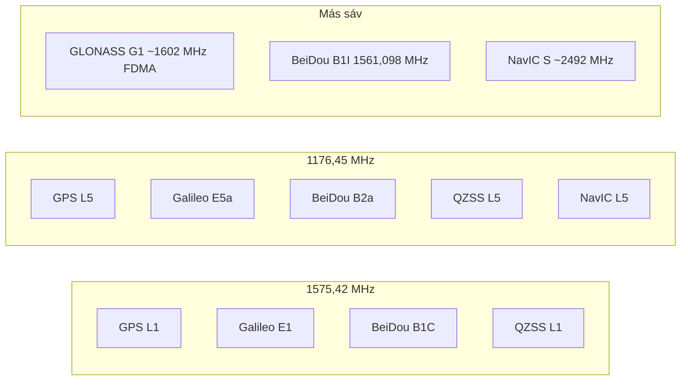

# GNSS rendszerek: GPS, Galileo, BeiDou, GLONASS, QZSS, NavIC

[README-hu.md](../README-hu.md) · [GPS adatút](GPSDATAFLOW-hu.md)

Ez **nem** a GTL kódjának leírása. Referencia a műholdrendszerekről és sávokról, amelyeket a telefon GNSS-chipje lát. A GTL skyploton és a GPS fülön ezek a rövidítések jelennek meg: GPS L1 / L5, GAL, BDS, GLO, QZSS, NavIC.

**Két dolgot ne keverj:** GPS L1 és L5 nem két rendszer, hanem **ugyanannak a GPS-nek két rádiófrekvenciája**. GAL, BDS, GLO, QZSS, NavIC viszont **külön konstelációk**.

---

## A nagy kép

Négy **globális** GNSS van, plusz két fontos **regionális**:

| Rendszer | Operátor | Lefedettség | Pálya | Típusos szerep |
| --- | --- | --- | --- | --- |
| **GPS** | USA | globális | MEO (~20 180 km, 55°) | de facto alap, L1 C/A mindenhol |
| **GAL** (Galileo) | EU | globális | MEO (~23 222 km, 56°) | polgári kontroll, HAS (~20 cm), SAR |
| **BDS** (BeiDou) | Kína | globális | MEO + GEO + IGSO | Ázsia-erős, rövidüzenet-szolgáltatás |
| **GLO** (GLONASS) | Oroszország | globális | MEO (~19 130 km, **64,8°**) | jobb sarki lefedettség |
| **QZSS** (Michibiki) | Japán | Ázsia–Óceánia | QZO/IGSO + GEO | GPS-kompatibilis kiegészítés Japán felett |
| **NavIC** | India (ISRO) | India + ~1500 km | GEO + IGSO | regionális, L5 + egyedi S-sáv |

A műholdak nem „más márkájú GPS-ek”. Mindegyik saját **időrendszert** és **koordinátakeretet** használ:

| Rendszer | Idő | Keret |
| --- | --- | --- |
| GPS | GPS Time (UTC-USNO) | WGS 84 |
| Galileo | Galileo System Time | GTRF (ITRF-hez igazítva) |
| GLONASS | GLONASS Time (UTC-SU) | PZ-90.11 |
| BeiDou | BeiDou Time (BDT) | CGCS2000 |

A vevő ezeket összehangolja; a felhasználó ezt általában nem látja.

---

## GPS L1 vs L5 — ugyanaz a rendszer, más jel

Mindkettő **GPS**, ugyanarról a műholdról (ha a műhold már modernizált). A különbség a **sáv és a jelszerkezet**.

| | **L1** | **L5** |
| --- | --- | --- |
| Frekvencia | **1575,42 MHz** | **1176,45 MHz** |
| Fő civil jel | L1 C/A (régi), plusz új L1C | L5 (I5 + Q5, data + pilot) |
| Chipráta / sávszélesség | ~1,023 Mcps, keskeny (~2 MHz) | **10,23 Mcps**, széles (~20 MHz) |
| Teljesítmény | alacsonyabb | **magasabb** (~+3 dB) |
| Spektrumvédelem | RNSS / ARNS | **ARNS** — légiközlekedési safety-of-life sáv |
| Hol van | minden GPS műhold, minden olcsó chip | IIF / III generáció; 2023-ban ~18 műhold, FOC később |

Az L5 a harmadik civil GPS-jel: nagyobb teljesítmény, nagyobb sávszélesség, jobb zavar- és többutas-ellenállás. L1+L5 együtt **ionoszféra-korrekciót** ad (a két frekvencia eltérően torzul az ionoszférában), ezért a kettős-frekvenciás vevő pontosabb, mint a sima L1-only.

Gyakorlatban:

- **L1 C/A:** a „régi GPS”, amit minden telefon, óra, olcsó modul ismer.
- **L5:** modernebb, „tisztább” civil jel; kevesebb műholdon van még, de L1-gyel párosítva ez a mai dual-frequency irány.

Van még **L2** (1227,60 MHz, L2C) — geodézia / survey klasszikus második sávja. A telefonos és IoT dizájnok inkább **L1+L5** felé mennek, mert Galileo E5a és BeiDou B2a **pont ugyanott** van.

GPS modernizációs civil jelek (összesen négy, ha L1 C/A-t is számoljuk):

| Jel | Frekvencia | Állapot (GPS.gov, 2023-as snapshot) | Miért van |
| --- | --- | --- | --- |
| L1 C/A | 1575,42 MHz | operatív, minden műhold | visszafelé kompatibilis alap |
| L2C | 1227,60 MHz | pre-operational, ~25 műhold | dual-frequency, kereskedelmi |
| L5 | 1176,45 MHz | pre-operational, ~18 műhold | safety-of-life, széles sáv |
| L1C | 1575,42 MHz | fejlesztés, GPS III | interoperabilitás Galileo / BeiDou / QZSS-szel |

L1C **nem** L1 C/A. Ugyanaz a vivő, más moduláció (MBOC), közös civil jelcsalád a Galileo E1 / BeiDou B1C / QZSS L1C felé.

---

## A közös sávok

Szándékos interoperabilitás: a rendszerek ugyanazokra a két L-sávos középfrekvenciára húzódtak.

**1575,42 MHz (L1-család)**  
GPS L1 · Galileo **E1** · BeiDou **B1C** · QZSS L1 · (új NavIC L1)

**1176,45 MHz (L5-család)**  
GPS L5 · Galileo **E5a** · BeiDou **B2a** · QZSS L5 · NavIC L5 · SBAS L5

Egy L1+L5 antennával GPS + Galileo + BeiDou-3 + QZSS (és részben NavIC) **ugyanazon az RF-frontenden** jön. USA–EU közös L1C/E1 (MBOC); BeiDou-3 is ide igazodott.

A régi BeiDou **B1I 1561,098 MHz**-en van — az még külön RF-t igényel.

---

## Rendszerenként

### GPS

USA Space Force. 24 slot + tartalékok (jelenleg ~31–32 aktív). **CDMA:** minden műhold ugyanazon a frekvencián, más PRN-kóddal.

Civil alap: L1 C/A. Modernizálás: L2C, L5, L1C.

### GAL — Galileo

EU, polgári kontroll. Tervezett 30 műhold, 3 sík (Walker), ~23 222 km. CDMA.

Nyílt jelek: **E1, E5a, E5b**; plusz **E6** High Accuracy Service (~20 cm, korrekciók). Az E5 AltBOC nagyon széles sáv — geodéziai minőség. Van Search-and-Rescue transzponder és OSNMA (jelhitelesítés). Nincs „régi C/A-örökség”: a nyílt szolgáltatás eleve modern.

| Jel | Frekvencia (MHz) | Szerep |
| --- | --- | --- |
| E1 | 1575,420 | nyílt, GPS L1-gyel interoperábilis |
| E5a | 1176,450 | nyílt, GPS L5-tel interoperábilis |
| E5b | 1207,140 | nyílt, safety-of-life / integritás |
| E5 AltBOC | 1191,795 | E5a+E5b szélessávú összetétel |
| E6 | 1278,750 | HAS / szabályozott szolgáltatás |

### BDS — BeiDou

Kína, 2020-tól globális (BDS-3). Hibrid pálya: MEO + **GEO** + **IGSO** — Ázsia felett sűrűbb az égbolt, mint GPS-nél.

- Régi: **B1I** 1561,098 MHz (BDS-2).
- Új, interoperábilis: **B1C** = L1, **B2a** = L5.

Van B3I (1268,52 MHz) és rövidüzenet-szolgáltatás (RDSS), ami a többinél nincs.

| Jel | Frekvencia (MHz) | Megjegyzés |
| --- | --- | --- |
| B1I | 1561,098 | BDS-2 örökség, külön RF |
| B1C | 1575,42 | GPS L1 / Galileo E1 |
| B2a | 1176,45 | GPS L5 / Galileo E5a |
| B2b | 1207,14 | Galileo E5b környéke |
| B3I | 1268,52 | nyílt / engedélyezett |

### GLO — GLONASS

A történelmi kivétel. Hagyományosan **FDMA:** minden műhold kicsit más G1/G2 csatornán (~1602 és ~1246 MHz), nem egy közös L1/L5 vivőn. Ezért a chipsetben külön GLONASS-ág kell.

Újabb műholdak (K2) CDMA-ra is mennek (G3 ~1202 MHz). **64,8° inklináció** → sarkvidéken gyakran jobb, mint GPS. Civil pontosság jellemzően kicsit gyengébb, mint Galileo / modern GPS.

| Jel | Frekvencia (MHz) | Hozzáférés |
| --- | --- | --- |
| G1 (L1) | ~1598–1609 | FDMA csatornák |
| G2 (L2) | ~1243–1252 | FDMA csatornák |
| G3 | 1202,025 | új CDMA jel |

### QZSS — Quasi-Zenith (Michibiki)

Japán regionális **GPS-kiegészítő**, nem önálló globális konkurens. Quasi-zenith pálya: Japán felett hosszú ideig magasan van, városban / hegyekben kevésbé takarja épület.

Jelei **GPS-kompatibilisek** (L1 C/A, L1C, L2C, L5). Extra: L6 (CLAS / MADOCA, cm-es korrekció), L1S augmentáció. 4 műholdos szolgálat 2018 óta; 7 műholdra bővül, hogy Japán felett **önállóan** is lehessen pozíciót számolni.

Lefedettség: Ázsia–Óceánia. Európában gyakorlatilag irreleváns.

### NavIC (IRNSS)

India regionális rendszere: 7 körüli GEO+IGSO. Lefedettség: India és kb. 1500 km a határon túl.

Fő jelek: **L5 (1176,45 MHz)** és egyedi **S-sáv ~2492 MHz** — ez a többinél nincs. Az újabb NVS műholdak **L1-et is** adnak, hogy GPS/Galileo chipsetekkel jobban együttműködjenek. Önálló indiai rendszer, nem GPS-klón, de L5-ön kompatibilis a közös sávval.

---

## Mi számít a vevőnek

1. **Több konsteláció** = több látható műhold = jobb városi / erdős rögzítés. GPS + GAL + BDS + GLO együtt ~100+ műhold az égen.
2. **Két frekvencia (L1+L5)** = ionoszféra-korrekció, kevesebb többutas hiba. Itt GPS L5, Galileo E5a, BeiDou B2a **összeadódik**.
3. **GLONASS** extra műhold, de más RF (FDMA). Hasznos, nem „ugyanaz a sáv”.
4. **QZSS / NavIC** csak a saját régiójukban adnak érdemi extra műholdat. Európában QZSS/NavIC gyakorlatilag irreleváns; Japánban QZSS nagyon sokat számít, Indiában NavIC.

A mai multi-GNSS vevő ezeket nem „választja”, hanem **összefésüli**.

---

## GTL-ben

A GTL a chip `GnssStatus` mintáit mutatja (konstelláció, vivő, used vs in view, skyplot). A **Csak GNSS** kapcsoló az Android `GPS_PROVIDER`-t kéri — a szolgáltató neve történeti, a chip **minden** fenti konstellációt használhatja, amit a telefon támogat.

Naplózási lánc: [GPSDATAFLOW-hu.md](GPSDATAFLOW-hu.md). Skyplot és Csak GNSS: [README-hu.md](../README-hu.md#gnss-skyplot).

---

## Források

- [GPS.gov — New Civil Signals](https://www.gps.gov/new-civil-signals) — L2C, L5, L1C
- [GPS.gov — Other GNSS](https://www.gps.gov/other-global-navigation-satellite-systems-gnss) — Galileo, BeiDou, GLONASS
- [ESA Navipedia — GPS Signal Plan](https://gssc.esa.int/navipedia/index.php/GPS_Signal_Plan)
- [ESA Navipedia — Galileo Signal Plan](https://gssc.esa.int/navipedia/index.php/Galileo_Signal_Plan)
- [ESA — Galileo system](https://www.esa.int/Applications/Satellite_navigation/Galileo/Galileo_system)
- [NovAtel — GNSS frequencies and signals](https://shop.novatel.com/s/contactsupport/article/GNSS-Frequencies-and-Signals)
- [GNSS Decoded — frequency bands](https://gnssdecoded.com/gnss-frequency-bands/)
- [QZSS — Transmission Signals](https://qzss.go.jp/en/overview/services/sv03_signals.html)
- [QZSS — seven-satellite constellation](https://qzss.go.jp/en/overview/services/seven-satellite.html)
- [BeiDou SIS ICD (B1I)](http://en.beidou.gov.cn/SYSTEMS/Officialdocument/201902/P020190227601370045731.pdf)
